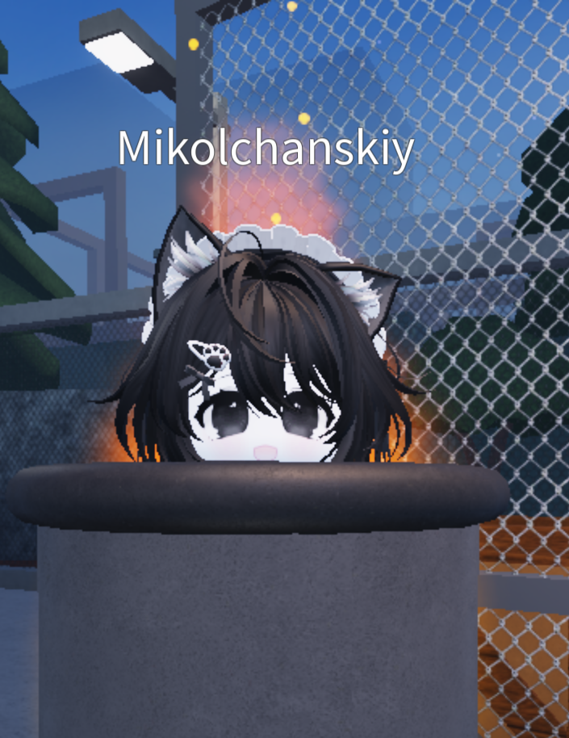

# 🚀 MSG Launcher

**MSG Launcher** — это современный лаунчер для Minecraft Bedrock Edition на Android, созданный на Kotlin для максимальной производительности и удобства.

---

## 📸 Галерея / Screenshots
*Здесь игроки увидят, как выглядит твой лаунчер в деле.*

  <table>
    <tr>
      <td></td>
      <td></td>
    </tr>
    <tr>
      <td align="center"><b>Главный экран</b></td>
      <td align="center"><b>Маркетплейс</b></td>
    </tr>
  </table>

---

## 🛠 Ключевые возможности
* **Интеграция с Firebase:** Стабильное хранение данных и быстрая синхронизация.
* **Встроенный Marketplace:** Удобный поиск и автоматическая установка дополнений.
* **Logcat оверлей:** Инструменты для отладки прямо в приложении.

## 📥 Как начать использовать
1. Скачай актуальную версию в разделе [Releases](https://github.com/ТВОЙ_НИК/msg-launcher/releases).
2. Установи APK-файл на свое устройство Android (версии 9.0 и выше).
3. При первом запуске следуй инструкциям на экране для настройки интеграции с Minecraft.

---
*Проект находится в стадии активной разработки. Будем рады любым предложениям по улучшению!*

<h1 align="center">
  
    🚀 msg-launcher
  
</h1>

Автоматическая загрузка файлов в GitHub

